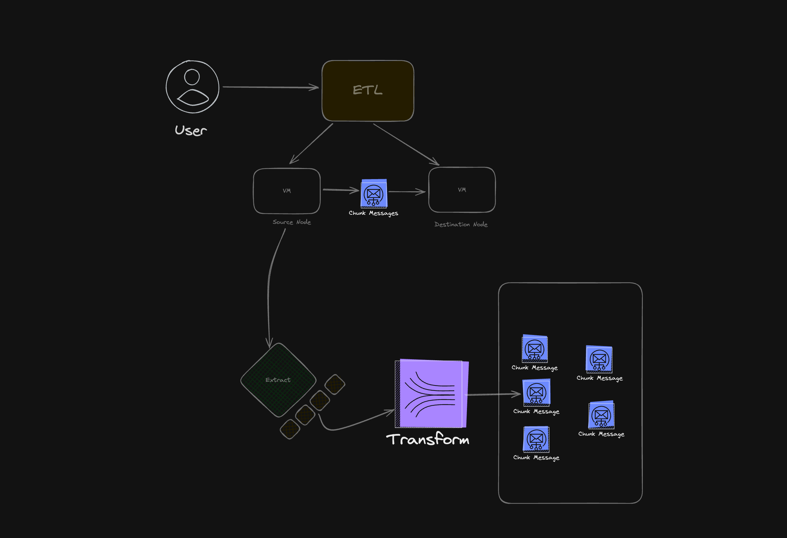

# ETL Pipeline System

This project is an Extract, Transform, Load (ETL) pipeline system built with Go, PocketBase, Docker, and RabbitMQ. It is designed to be modular, scalable, and capable of handling various data synchronization strategies, including full overrides, incremental syncs, and deduplication.

## Table of Contents

- [Introduction](#introduction)
- [Architecture Overview](#architecture-overview)
- [Components](#components)
  - [PocketBase Server](#pocketbase-server)
  - [ETL Orchestrator](#etl-orchestrator)
  - [Docker Manager](#docker-manager)
  - [Extractors and Loaders](#extractors-and-loaders)
  - [RabbitMQ](#rabbitmq)
- [Features](#features)
- [Getting Started](#getting-started)
  - [Prerequisites](#prerequisites)
  - [Setup Instructions](#setup-instructions)
- [Usage](#usage)
  - [Defining Sources and Loaders](#defining-sources-and-loaders)
  - [Creating Connections](#creating-connections)
  - [Running ETL Jobs](#running-etl-jobs)

## Introduction

This ETL pipeline system provides a flexible framework for extracting data from various sources, transforming it, and loading it into different targets. It leverages PocketBase as an admin interface and data store, uses Docker to containerize extractors and loaders, and employs RabbitMQ for message queuing between components.

## Architecture Overview



The system consists of the following key components:

- **PocketBase Server**: Acts as the central data store and admin interface.
- **ETL Orchestrator**: Manages the scheduling and execution of ETL workflows.
- **Docker Manager**: Handles the creation and management of Docker containers for extractors and loaders.
- **Extractors and Loaders**: Modular components that perform data extraction and loading.
- **RabbitMQ**: Facilitates communication between extractors and loaders through message queues.

## Components

### PocketBase Server

PocketBase is used as the backend server for managing configurations, states, and other metadata. It provides an easy-to-use admin UI and RESTful API for interacting with the system.

- Stores definitions for sources, loaders, and connections.
- Maintains state information for incremental syncs and deduplication.
- Provides an admin interface for managing the ETL pipeline.

### ETL Orchestrator

The orchestrator is responsible for coordinating the ETL workflows based on the configurations stored in PocketBase.

- Schedules ETL jobs using cron expressions.
- Initiates the ETL workflow by starting extractors and loaders as Docker containers.
- Manages the state and execution flow of ETL jobs.

### Docker Manager

A custom Go package (`dockermanager`) that handles the creation, starting, and stopping of Docker containers.

- Connects to the Docker daemon to manage containers.
- Passes environment variables and configurations to containers.
- Handles networking and volume mounting for containers.

### Extractors and Loaders

Modular components that perform the actual data extraction and loading.

- **Extractors**: Fetch data from various sources (files, APIs, databases).
- **Loaders**: Load transformed data into target destinations (files, databases, message queues).
- Implement a common interface for consistency and extensibility.
- Use environment variables to receive configurations and state information.

### RabbitMQ

RabbitMQ is used as a message broker to facilitate communication between extractors and loaders.

- Each ETL job can have its own dedicated queue.
- Supports dynamic queue creation and deletion based on `connectionId`.
- Enables scalable and decoupled data processing.

## Features

- **Modular Design**: Easily add new extractors and loaders.
- **Flexible Scheduling**: Supports manual and scheduled ETL jobs using cron expressions.
- **Dynamic Container Management**: Starts and stops Docker containers for extractors and loaders as needed.
- **State Management**: Maintains state for incremental syncs and deduplication.
- **Scalability**: Potential to integrate with Kubernetes for scaling workloads.
- **Extensibility**: Designed to accommodate various data sources and synchronization strategies.

## Getting Started

### Prerequisites

- **Docker**: Ensure Docker is installed and running on your machine.
- **Docker Compose**: For orchestrating multi-container applications.
- **Go**: Version 1.20 or higher for building Go applications.

### Setup Instructions

1. Run the server stack with RabbitMq

```bash
docker compose up --build -d // this will build the server image and start the server and rabbitmq
```
2. Build extractors and loaders

```bash
> docker build -t [extractor_name]:latest -f build/sources/[extractor_name]/Dockerfile .
```

```bash
> docker build -t [loader_name]:latest -f build/loaders/[loader_name]/Dockerfile .
```

## Usage

* Create a new admin account on pocketbase installer at localhost:8090/_
* Inside the dashboard create a new user record under user collection.
* Get authorization token for the user from admin api.
```bash
curl -X POST "http://localhost:8090/api/collections/users/auth-with-password" \
-H "Content-Type: application/json" \
-d '{ "identity": "example@gmail.com", "password": "example" }'
```

### Defining Source and Loaders

> Create a Source
```bash
curl -X POST "{{etl_backend}}/api/source" \
-H "Authorization: {{user_token}}" \
-H "Content-Type: application/json" \
-d '{ "name": "my_extractor", "type": "file_extractor", "config": {} }'

```

> Create a Loader

```bash
curl -X POST "{{etl_backend}}/api/loader" \
-H "Authorization: {{user_token}}" \
-H "Content-Type: application/json" \
-d '{ "name": "my_loader", "type": "json_loader", "config": {} }'

```

### Creating Connections

```bash
curl -X POST "{{etl_backend}}/api/connection" \
-H "Authorization: {{user_token}}" \
-H "Content-Type: application/json" \
-d '{ "source_id": "ftjagtp7kmnr0ow", "loader_id": "kf1ljoa5jkx93jc", "sync_type": "manual", "config": {} }'
```

### Running ETL Jobs

```bash
curl -X POST "{{etl_backend}}/api/sync" \
-H "Authorization: {{user_token}}" \
-H "Content-Type: application/json" \
-d '{ "connection_id": "s241kqmo3kv8mby" }'

```